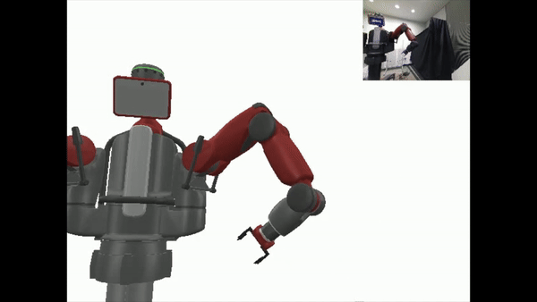

## Model Predictive Control for quadrupeds - Reconstruction of Robot Motion from video 
- This work is about reconstructing robot motion from video by pose estimation using keypoint detection and implementation on real robot using MPC
- Based on Robotoc(https://github.com/mayataka/robotoc) modified to handle reconstructed waypoints for feet in task space and entire body in configuration space

## Requirements
- Ubuntu 22.04, 20.04, and 18.04 (possibly Mac OSX, but not well tested)
- gcc (at least C++11 is required), CMake (at least version 3.11)
- Eigen3, [Pinocchio](https://stack-of-tasks.github.io/pinocchio/download.html)  , 
- Python3, NumPy (for Python binding)
- [gepetto-viewer-corba](https://github.com/Gepetto/gepetto-viewer-corba.git) and/or [meshcat-python](https://github.com/rdeits/meshcat-python) (optional to visualize the solution trajectory in Python) 
- [pinocchio-gepetto-viewer](https://github.com/stack-of-tasks/pinocchio-gepetto-viewer) (optional to visualize the solution trajectory in C++) 
- [PyBullet](https://pybullet.org/wordpress/) (optional to simulate MPC examples)

## Example of Motions with reconstructed waypoints(Dancing Quadruped)
- Keypoint detection on quadruped and pose estimation

- Simulation of estimated poses on quadrupeds on real robot

## Example of Motions with reconstructed waypoints(Manipulator)
- Keypoint detection on manipulator and pose estimation

